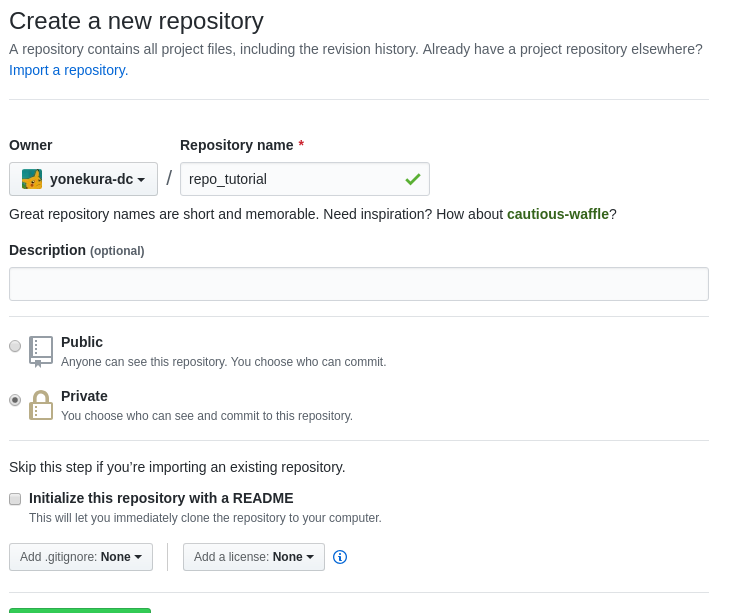
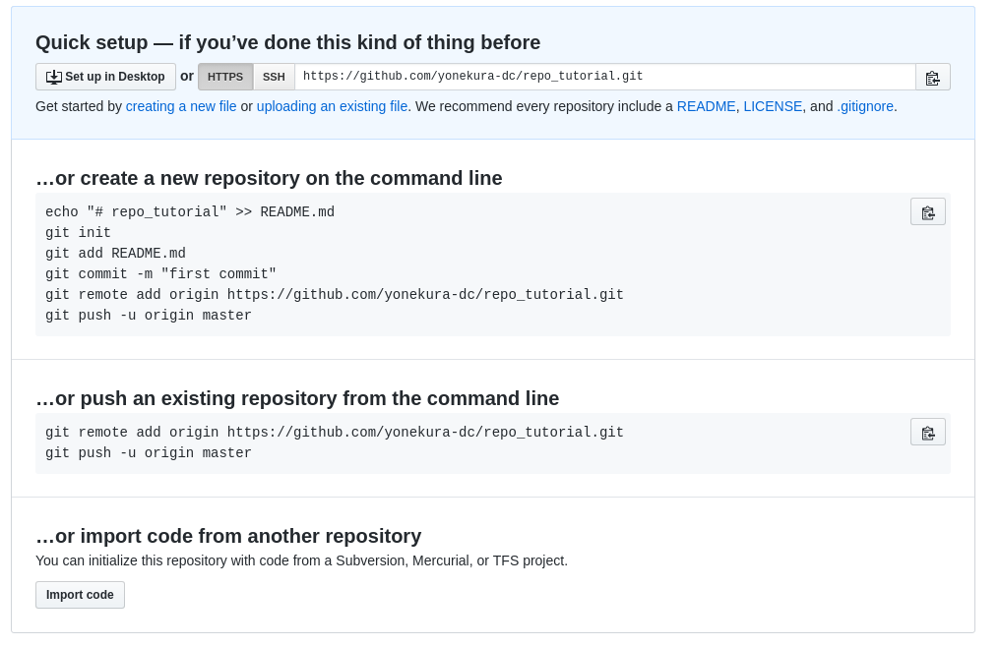

# Todo
- [x] Git 101
- [ ] 'Refatorar' Git 101 
- [ ] Adicionar refs
- [ ] Testar Git 101 no Windows
- [ ] Git Branch
- [x] Como instalar o Anaconda e o labelme
- [ ] Como usar o labelme
- [ ] Guideline de segmentação

# PCA Coin label

## Preparando o ambiente de trabalho
### Ubuntu 19.10+ / Debian (sid)
Nas distribuições mais novas do Ubuntu e no Debian (sid),
o programa pode ser facilmente instalado com o comando abaixo:
```
sudo apt-get install labelme
```
### Windows e outras distribuições de Linux
Para instalar o programa nesses sistemas é necessário instalar o **Anaconda**, o Anaconda é uma distribuição de Python que facilita a instalação de programas e bibliotecas.

[Tutorial de Instalação no Windows e Ubuntu](https://minerandodados.com.br/instalar-python-anaconda/).

Após instalar o Anaconda, basta executar o comando abaixo:
```
conda install labelme -c conda-forge
```
### MacOs
```
brew install pyqt  # maybe pyqt5
pip install labelme
```

## Git & Github 101

### Conceitos
**Git** é um programa de versionamento de software que facilita a vida de qualquer programador/desenvolvedor,
trata-se de uma ferramenta que localiza mudanças em arquivos do projeto e coordena o trabalho 
realizado pelas pessoas envolvidas no projeto.

**Github** é uma plataforma web que permite a hospedagem de projetos utilizando a ferramenta Git,
essa plataforma é usada para facilitar o desenvolvimento de um projeto, pois oferece funcionalidades
extras ao git e também permite o acesso ao código fonte de softwares *open-source*.


### First Repo
Nessa seção, veremos como criar e usar um repositorio no github.
  
#### Passo 0.1: Criar uma conta no Github
Para usar o github é necessário uma conta, estudantes da UEA tem direito ao Github Pro,
que permite a criação de repositórios privados. 

[Como conseguir a licença de estudante](https://www.treinaweb.com.br/blog/como-obter-uma-licenca-para-estudante-no-github/), caso já tenha uma conta com outro email é possível linkar a conta da universidade e conseguir a licença.


#### Passo 0.2: Instalando e configurando o Git
[Como instalar o Git para Windows/Mac/Linux](https://git-scm.com/book/pt-br/v1/Primeiros-passos-Instalando-Git)

Para configurar o git, basta executar os seguintes comandos no terminal:
```
# o $ indica o inicio do comando, nao digite ele
# '#' inicia comentarios
$ git config --global user.name "username_usado_no_git"
$ git config --global user.email "iniciais@curso.uea.edu.br"
```

#### Passo 1: Inicializando o repositório

No terminal basta executar essa sequência de comandos:
```
$ mkdir repo    #cria o diretorio do repositorio
$ cd repo       #entra no dir
$ git init      # inicializa o git
Initialized empty Git repository in /home/yonekura/Documents/repo/.git/
```

#### Passo 2: Mudanças
Agora que temos o repo criado, precisamos colocar alguma coisa nele, em projetos open-source é comum a presença de um arquivo README.md, esse arquivo normalmente contém informações gerais sobre o projeto, requisitos para usar o software, e tutorias (como esse).

O README.md pode ser criado pelo terminal ou por um editor de texto:
``` 
$ touch README.md
 ```
 
Com o README.md criado, precisamos avisar para o Git que queremos "rastrear" o arquivo, isso é importante, pois arquivos não rastreados são ignorados pelo Git. Para ver a situação de um arquivo e rastrea-lo:
```
# para ver quais arquivos estao sendo rastreados
$ git status
On branch master
No commits yet
Untracked files:
  (use "git add <file>..." to include in what will be committed)
	README.md
nothing added to commit but untracked files present (use "git add" to track)

$ git add README.md
$ git status
On branch master
No commits yet
Changes to be committed:
  (use "git rm --cached <file>..." to unstage)
	new file:   README.md
```
#### Passo 3: First Commit
Agora que o git está rastreando o arquivo, podemos criar um commit, o commit é tipo um savepoint, ele pode restaurar o estado que o repo estava e voltar para o presente (chamado de HEAD).

Para commitar o repo:
```
$ git commit -m "Mensagem do commit"
```
Existem boas práticas de como fazer uma mensagem de commit, não vou falar sobre.

#### Passo 4: Repositório no Github
Com o commit criado, o próximo passo é criar o repo no github.
 
 
 
 

## Workflow Linux
Na primeira vez que executar o programa, é necessário criar uma branch própria.
   1. Abra o terminal.
   2. Mude para o diretório com o número de sua matrícula:
  ```
  cd <endereco_do_repo>/<Matricula>/ 
  #exemplo
  cd /home/user/Documents/pca-coinlabel/<Matricula>/
 ```
   4. Crie uma branch com seu <Nome ou Matrícula> `git checkout -b <Matricula>`.
   5. Execute o comando `labelme .` (O ponto representa o diretório atual).
